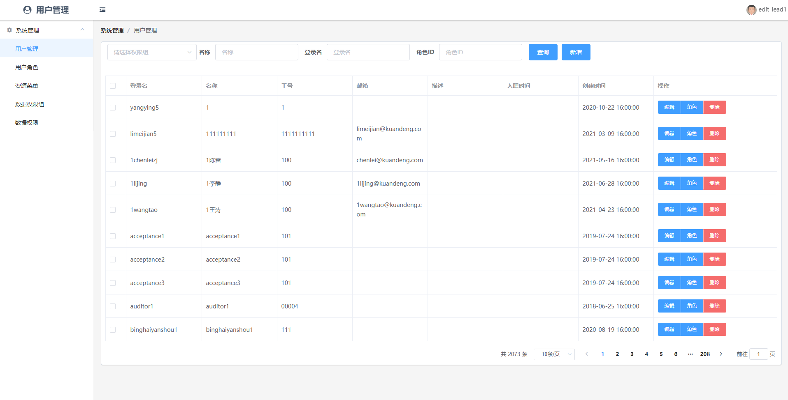
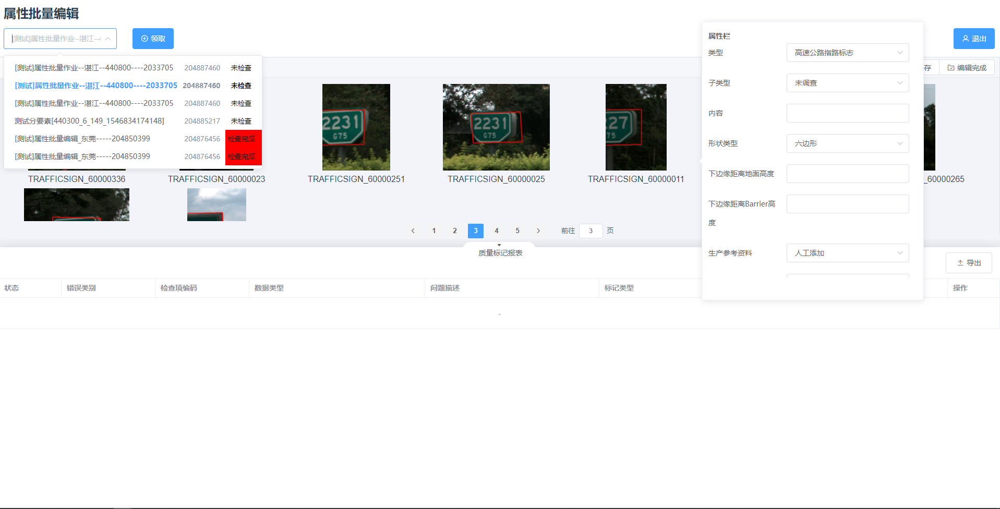
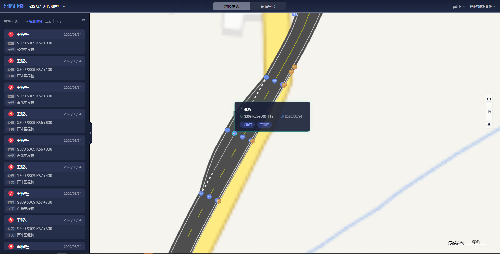
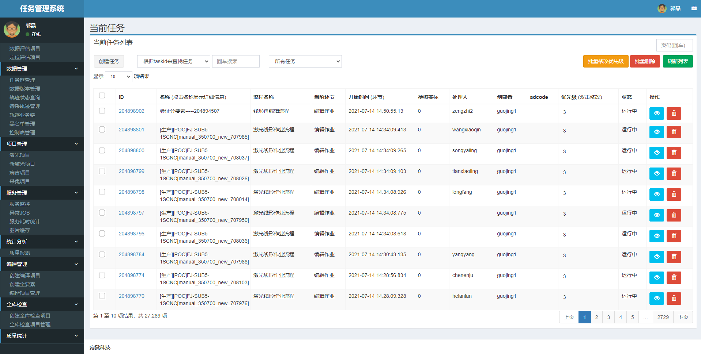
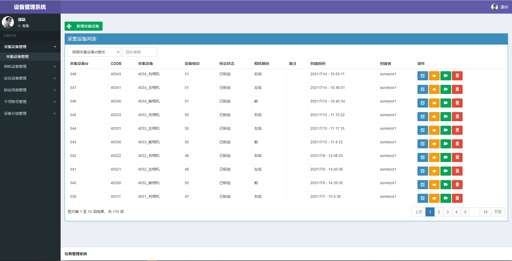
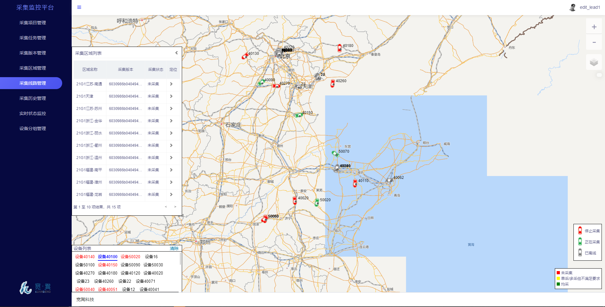

宽凳项目 - 黄鑫

## 项目列表
`kpms-web`
简介：基于VUE2.0、EleUI、Bootstrap开发的用户管理后台系统。
在线体验：[https://git.io/fp9UM](http://kpms-web.gzproduction.com/kpms-web/#/)

`batch-edit`
简介：基于VUE3.0、EleUI开发的地图数据批量编辑系统。
在线体验：[https://git.io/fp9UM](http://srv-10.gzproduction.com:13920/web_editor/batch-edit/dist/index.html)

`pdds-web`
简介：基于CESIUM、mapBox开发的地图病害数据预览系统。
在线体验：[https://git.io/fp9UM](https://rmms.kuandeng.net/index.html)

`kts-web`
简介：基于jQuery、adminLTE、Bootstrap开发的地图数据管理系统。
在线体验：[https://git.io/fp9UM](http://srv-10.gzproduction.com:13920/kts-web/starter1.html)

`krms-web`
简介：基于jQuery、adminLTE、Bootstrap开发的设备数据管理系统。
在线体验：[https://git.io/fp9UM](http://srv-10.gzproduction.com:13920/krms-web/index.html)

`kcms-web`
简介：基于jQuery、adminLTE、Bootstrap开发的采集数据管理系统。
在线体验：[https://git.io/fp9UM](http://192.168.7.28:13920/kcms-web/pages/collectionLink.html)

## 截图

